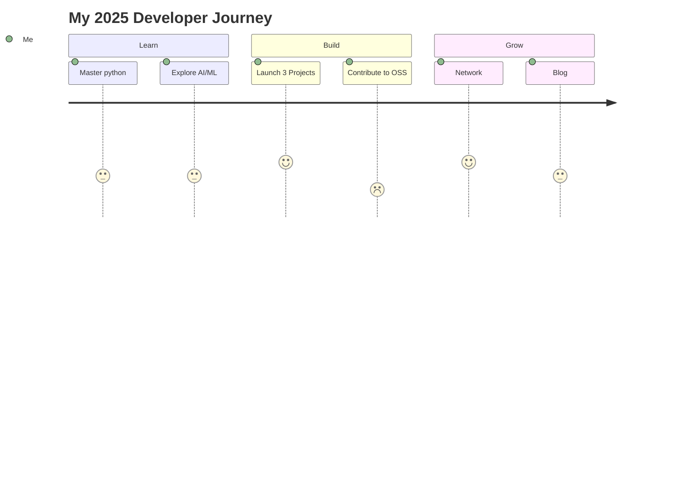

**Currently jamming to:**  

Building cool stuff • Learning AI/ML • Debugging with beats 🎵

---

    

```mermaid
journey
title My 2025 Developer Journey
section Learn
Master python: 3: Me
Explore AI/ML: 3: Me
section Build
Launch 3 Projects: 4: Me
Contribute to OSS: 2: Me
section Grow
Network: 4: Me
Blog: 3: Me
```
---
